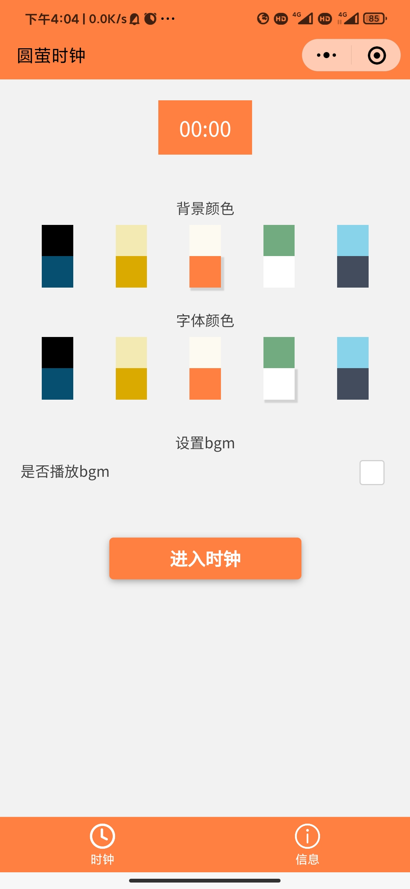
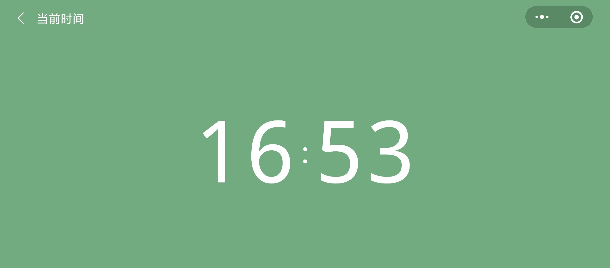

# 圆萤时钟 🕒

圆萤时钟是一款非常简洁的高颜值全屏时钟小程序，助你学习的时候抵制手机诱惑，专注学习本身。

适合小程序初学者做入门项目练习 🎯。

## Features

- Clock
- BGM

## Technology stack

- 微信小程序
- WeUI
- Serverless Cloud Function（云函数）

## Demo

扫码体验👇

## Note

BGM来自网易云音乐，API使用[网易云音乐 Node.js API service](https://github.com/Binaryify/NeteaseCloudMusicApi)，API部署到国外服务器时会无法获取某些音乐的播放地址。

小程序只可以跟有备案的域名进行网络通信，为了绕过这一限制，我采用云函数来中转网络请求。

## Reference

[全屏倒计时](https://www.bilibili.com/video/BV1D7411x7kc/?p=8)